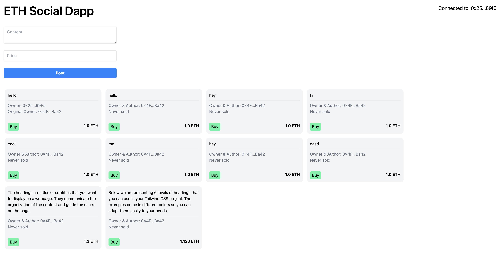

# Eth Social Dapp

A simple social media dapp built on the Ethereum blockchain, which allow user to create post as an NFT, view posts and purchase posts.

> Note: The app is not deployed to any testnet or mainnet, it is only running on a local blockchain for the purpose of learning. Do not use it to store any real ETH or NFTs.

## Getting Started

- Install [Ganache](https://trufflesuite.com/ganache/) for running a private blockchain
  - In Ganache, create a new network, remember the port.
- Install Metamask or an EVM compatible wallet, enable/add the network created in Ganache. (something like http://localhost:7545)
- Run `npm install` to install dependencies.
- Run `npm run migrate` to compile and deploy the smart contracts to the local blockchain.

## Development

### Remember to run `npm run migrate` after making changes to the smart contracts.

### Send ETH to your wallet

- In Ganache **Accounts** tab, copy one of the public key that starts with `0x` as a sender. Remember to choose the one that has some ETH.
- In Metamask, copy the public key of the account that you want to send ETH to.
- Run `npm run console` to open the truffle console.
- Run `web3.eth.sendTransaction({from: '0x_sender_address', to: '0x_receiver_address', value: web3.utils.toWei('amount_to_send')})`
- Go back to your wallet and switch to the Localhost network, you should see the ETH balance updated.

### Link Truffle to Ganache
- In Ganache running serer, open **Contracts** -> Add Project -> Select the `truffle-config.js` file in the project folder.
- You will see the list of contracts that are compiled and which has been deployed to the Ganache blockchain.

## Troubleshooting
### Wallet popup not showing up
- Make sure you have a browser wallet installed and enabled.
- Make sure you allow popups from the site.
